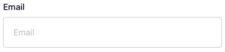
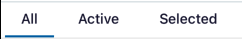
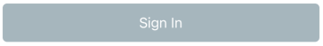
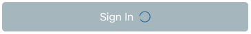
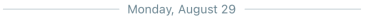
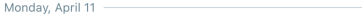
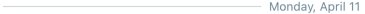

### Components

* Page Container
* Header
* Badge
* [Button](#button)
* [Icon](#icon)
* [LinedText](#linedtext)
* Loading
* Modal
* [Tabs](#tabs)
* [TextInput](#textinput)

##### TextInput

wrapper for [React Native TextInput](https://reactnative.dev/docs/textinput)

* You can have your own style and features
* `Props` extends `TextInputProps`

| Prop           | Type                 | Required | Default         | Description                            |
|:--------------:|:--------------------:|:--------:|:---------------:|:--------------------------------------:|
| label          | string               | No       | -               | will show label on top of Input        |
| containerStyle | StyleProp<ViewStyle> | No       | -               | style for container of Input and Label |
| labelStyle     | StyleProp<TextStyle> | No       | -               | style for label                        |
| disabled       | boolean              | No       | false           | is input disabled?                     |
| iconName       | string               | No       | -               | prefix icon name                       |
| iconFamily     | IconFamilies         | No       | mdi             | prefix icon family                     |
| iconSize       | number               | No       | IconSizes.small | prefix icon size                       |
| iconColor      | string               | No       | Colors.black    | prefix icon color                      |

##### Tabs

Component for showing some tabs in a row using `ScrollView`

| Prop         | Type                       | Required | Default | Description                                           |
|:------------:|:--------------------------:|:--------:|:-------:|:-----------------------------------------------------:|
| labels       | string[]                   | Yes      | -       | label of tabs to render                               |
| onTabChanged | (tabIndex: number) => void | No       | -       | callback which will be triggered after changing a tab |
| currentTab   | number                     | No       | -       | index of selected tab                                 |
| style        | StyleProp<ViewStyle>       | No       | -       | style for tabs container which is ScrollView          |

#### Button

Button which is using `TouchableOpacity` and have `label` and `loading` state, it also will handle `disabled` state in
terms of UI

* You can have your own style and features
* `Props` extends `TouchableOpacityProps`

*Enabled*

*Disabled*

*Loading*

| Prop    | Type                   | Required | Default   | Description                         |
|:-------:|:----------------------:|:--------:|:---------:|:-----------------------------------:|
| label   | string                 | Yes      | -         | label of button                     |
| loading | boolean                | No       | false     | showing spinner in loading state    |
| type    | "primary", "secondary" | No       | "primary" | will show different type of buttons |

#### Icon

This component is wrapper for `react-native-vector-icons` Icon component, which you can define `family` and it will
render proper iconset

| Prop   | Type                 | Required | Default         | Description          |
|:------:|:--------------------:|:--------:|:---------------:|:--------------------:|
| name   | string               | Yes      | -               | icon name            |
| family | "mdi", "fa", "mi"    | No       | "mdi"           | icon font family     |
| size   | number               | No       | IconSizes.small | icon size            |
| color  | string               | No       | Colors.black    | icon color           |
| style  | StyleProp<ViewStyle> | No       | -               | icon component style |

#### LinedText

This component will render a text with some lines next to it

*Centered*

*Left*

*Right*

| Prop           | Type                                     | Required | Default         | Description                             |
|:--------------:|:----------------------------------------:|:--------:|:---------------:|:---------------------------------------:|
| alignment      | "center", "right", "left"                | Yes      | -               | where should be label relative to lines |
| label          | string                                   | Yes      | -               | label                                   |
| color          | string                                   | No       | Colors.text_200 | color of label                          |
| lineColor      | string                                   | No       | Colors.border   | color of lines                          |
| hasLine        | boolean                                  | No       | false           | should render lines or not              |
| containerStyle | StyleProp<ViewStyle>                     | No       | -               | style for container of label and lines  |
| labelStyle     | StyleProp<ViewStyle>                     | No       | -               | style for label                         |
| onLabelPress   | ((event: GestureResponderEvent) => void) | No       | -               | on press for Text component             |

